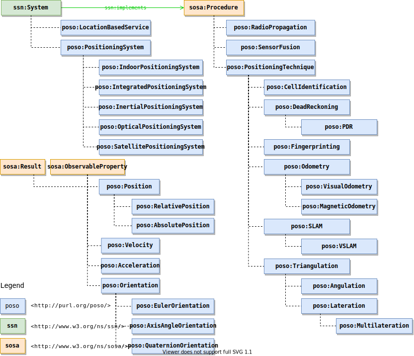

# POSO: A Generic Positioning System Ontology
*POSO is a generic ontology positioning system ontology. Other than many geospatial ontologies, POSO focuses on the semantics needed to express a positioning system, their techiques and the location data along with other information it can output.*

> :warning: **Anonymised Repository**: The repository and contents are anonymised. Copyright information is redacted from this README and the metadata in the ontology. Please do not use the version of the ontology provided in this repository. The permanent URL (purl) used in this ontology is directed to the anonymised version.

## Repository Contents
- `/1.0/`: POSO 1.0 ontology and related modules
    - `/1.0/poso.ttl`: POSO core ontology
    - `/1.0/catelog-v001.xml`: Protege catalog used for the Owlery API
    - `/1.0/common/poso-common.ttl`: POSO-common ontology with individuals for algorithms, techniques and existing systems
    - `/1.0/m3lite/poso-m3lite.ttl`: POSO-m3lite allignment (wip)
    - `/1.0/hdgi/poso-hdgi.ttl`: POSO-hdgi allignment (wip)
- `/docker/`: Docker related files
    - `/docker/owlery/application.conf`: Owlery API configuration
    - `/docker/widoco/Dockerfile`: WIDOCO document generator docker file
- `/docs/`: Documentation related files for the wiki
    - `/docs/images/`: POSO ontology documentation images
- `/website/`: Website and build scripts for deployment
- `/examples/`: Examples

## Classes

### System

#### `poso:PositioningSystem`
A positioning system is a **deployed** sytem that can obtain a position.

#### `poso:LocationBasedService`
A location-based service is a black box interface for a positioning system.

### Feature Of Interest
POSO extends the concepts of `sosa:FeatureOfInterest` with more specific features.

#### `poso:TrackedFeature`
A tracked feature is a tracked object, entity or feature. It is a spatial object with at least one `poso:hasPosition` property.

### Stimulus
A positioning system can be triggered by movement. We identify linear (i.e. `poso:LinearMovement`) and angular movement (i.e. `poso:AngularMovement`) as two possible events that can
cause an update of the output position. An application that shows the position of a person on a map might only be interested in linear movement while a navigation application requires real-time orientation updates.

### Procedure
> A workflow, protocol, plan, algorithm, or computational method specifying how to make an Observation, create a Sample, or make a change to the state of the world (via an Actuator). A Procedure is re-usable, and might be involved in many Observations, Samplings, or Actuations. It explains the steps to be carried out to arrive at reproducible Results.

In the context of a positioning system, a procedure is an algorithm or computational method to sample sensor data to a position. POSO offers general classes for the different positioning techniques, and individuals for well known positioning algorithms in the `poso-common` module.

### Observable Properties
> An observable quality (property, characteristic) of a FeatureOfInterest.

POSO aims to observe the position, orientation and related properties needed in a positioning system. Classes are available for a position (i.e. absolute or relative), orientation and velocity.

## Properties

### `poso:hasPosition`, `poso:hasOrientation`, `poso:hasVelocity`, `poso:hasAcceleration`
Sub properties of `ssn:hasProperty`, the properties indicate a specific type of property. Link traversal query processors could utilise these semantics to skip link traversal to datasets of irrelevant properties.

### `poso:madeBySystem`
SOSA and SSN offer properties for linking an Observation to a procedure that is implemented by a system. One single procedure
can be implemented by multiple systems. In order to have a deterministic link between the observation and the system that observed it, we use `poso:madeBySystem`.

### `poso:isRelativeTo`
In order to indicate a relative position relative to another feature of interest, the `poso:isRelativeTo` property can be used. In combination with the existing `ssn:isPropertyOf` property, this can indicate a relative position of a feature of interest, relative to another feature of interest.

## Individuals

### Positioning Systems
A positioning system is an established system for obtaining a position. Existing satelite systems such as GPS and GLONASS exist that can be used. `poso-common` already provides these systems as existing individuals.

## Documentation
Documentation is provided using WIDOCO [2] and generated in the `./website` directory upon building the website.

## License
POSO is licensed under the [MIT license](LICENSE) and maintained by the Web & Information Systems Engineering Lab at the Vrije Universiteit Brussel.

## References
*This list of references is only used within this README document. For more references on design choices in the POSO ontology, please refer to the paper and its references.*
1. Haller, A., Janowicz, K., Cox, S. J., Lefrançois, M., Taylor, K., Le Phuoc, D., ... & Stadler, C. (2019). The modular SSN ontology: A joint W3C and OGC standard specifying the semantics of sensors, observations, sampling, and actuation. Semantic Web, 10(1), 9-32.
2. Garijo, D. (2017, October). WIDOCO: a wizard for documenting ontologies. In International Semantic Web Conference (pp. 94-102). Springer, Cham.